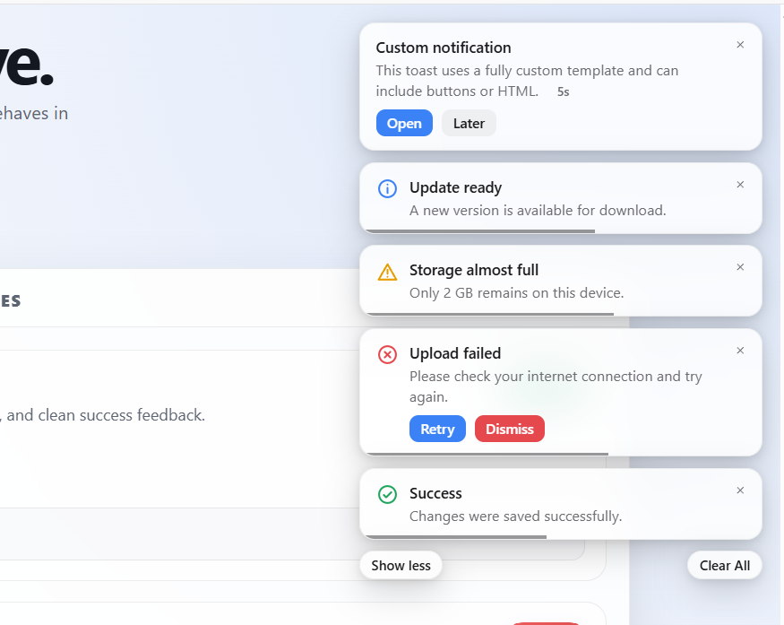
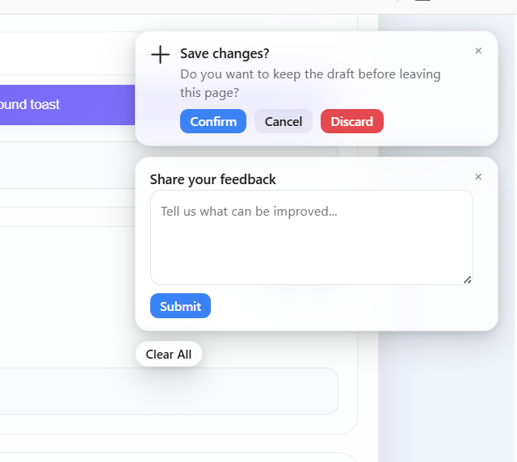

# ChimeKit

## Toast Notifications, Toaster Notifications & Notification Library for JavaScript, React, Vue, and Angular

ChimeKit is a lightweight toast notifications and toaster notifications library for JavaScript,
TypeScript, React, Vue, Angular, and other frontend frameworks. It delivers macOS-style alerts,
notification UI, toast messages, and custom action flows with zero runtime dependencies.

**[▶ Live demo](https://vikaschauhan123.github.io/chimekit/)** — a playground covering every
option below.

<p align="center">
  
  
</p>

- Stacked toasts in any of 6 positions, with "Show more / Show less" and "Clear All"
- 4 built-in types (`success` / `error` / `warning` / `info`) plus fully custom notifications
- 3 timer styles (`progress-bar`, `countdown-number`, `none`) with pause-on-hover — work on action
  notifications too, fully independent of `actions`
- Custom HTML messages via `message: { html: '...' }`, alongside plain text/`HTMLElement`/function —
  mark exactly where the countdown-number timer renders with `COUNTDOWN_SLOT_ATTR`, so custom HTML
  can appear before *and after* the countdown
- Per-notification `backgroundColor` / `textColor` overrides for one-off custom styling
- Every `notify.*()` call returns the notification's `id`; every close reports that same `id` back
- Every rendered part (toast, icon, title, message, actions, close button, timer UI, …) gets a
  stable, unique DOM `id` for direct CSS/JS targeting
- Optional backdrop, dedupe strategies, `singleAtATime` mode
- Optional notification sound effects at the global or per-toast level with built-in presets and custom audio file support
- Full TypeScript types, ESM + CJS + UMD builds, tree-shakeable
- Optional `chimekit/react`, `chimekit/angular`, and `chimekit/vue` adapters, each a thin wrapper
  (sub-1KB gzip) over the same shared engine — no duplicated core code, no separate singletons
- Ships with a live playground on GitHub Pages at [`https://vikaschauhan123.github.io/chimekit/`](https://vikaschauhan123.github.io/chimekit/), which redirects to [`demo/index.html`](https://vikaschauhan123.github.io/chimekit/demo/index.html)

## Install

```bash
npm i chimekit
```

Import the library and include the package stylesheet:

```js
import { notify, configure } from 'chimekit';
import 'chimekit/style.css';
```

If you are using a CSS file directly, this is the package path that gets shipped:

```css
@import 'chimekit/style.css';
```

## Quick start

```js
configure({
  position: 'top-right',
  maxVisible: 3,
  singleAtATime: false,
  backdrop: { enabled: false },
});

notify.success({
  title: 'Saved',
  message: 'Your changes have been saved.',
  duration: 4000,
  timerStyle: 'progress-bar',
});

notify.error({
  title: 'Upload failed',
  message: 'Please check your connection and try again.',
  duration: 'infinite',
  actions: [{ id: 'retry', label: 'Retry', style: 'primary' }],
  onAction: (id, actionId) => { if (actionId === 'retry') retryUpload(); },
});

notify.custom({
  icon: false,
  message: 'Copied to clipboard',
  duration: 1500,
  timerStyle: 'none',
  showCloseButton: false,
});

const id = notify.info({ message: 'Syncing…', duration: 'infinite', unique: 'sync-status' });
notify.close(id);

notify.custom({
  title: 'Custom colors',
  message: 'One-off styling for just this toast.',
  backgroundColor: '#111827',
  textColor: '#fde68a',
  duration: 5000,
});
```
 
### Global and per-toast animation

Use the same animation config at the library level or override it on a single notification.
Supported presets include `fade-in` / `fade-out`, `slide-left`, `slide-right`, `slide-top`,
`slide-bottom`, and `zoom-in` / `zoom-out`.

```js
configure({
 animation: {
   enter: 'slide-left',
   exit: 'fade-out',
 },
});

notify.success({
 title: 'Saved',
 message: 'Your profile was updated.',
 duration: 2500,
 animation: {
   enter: 'zoom-in',
   exit: 'slide-top',
 },
});
```
 
### Notification sounds and custom audio

You can play a sound on toast open globally or for a single notification. ChimeKit ships with a set of
built-in default presets: `default`, `success`, `error`, `warning`, `info`, and `os-1` through
`os-6`. The bundled demo tones are intentionally tiny mono WAV files so they stay lightweight and do not add noticeable startup overhead or app-wide audio cost.

```js
configure({
  sound: {
    preset: 'os-3',
    volume: 0.45,
  },
});

notify.error({
  title: 'Upload failed',
  message: 'Please check your internet connection.',
  duration: 5000,
  sound: {
    preset: 'error',
    volume: 0.5,
  },
});

notify.info({
  title: 'Synced',
  message: 'Everything is up to date.',
  duration: 3000,
  sound: {
    src: '/assets/quiet-chime.wav',
    volume: 0.4,
  },
});

const customAudio = document.getElementById('custom-sound-file');
notify.success({
  title: 'Custom alert',
  message: 'Playing an uploaded sound file.',
  duration: 4000,
  sound: {
    src: customAudio.files?.[0] ? URL.createObjectURL(customAudio.files[0]) : '/assets/notify.wav',
    volume: 0.45,
  },
});
```

Use `sound: false` to disable audio for a toast or set the global config to `false` to silence all
notifications. If you pass a custom `src`, it is used instead of the preset tone.

### Notification-level dedupe

Use `unique` on a toast to keep only one visible instance of that notification at a time. If a new
notification has the same `unique` key as an already-open toast, the original toast stays and the new
one is ignored (or its timer is restarted / moved to the top depending on the global
`duplicateStrategy`).

```js
notify.info({
  title: 'Syncing',
  message: 'Your profile is syncing…',
  duration: 'infinite',
  unique: 'profile-sync',
});

notify.info({
  title: 'Syncing',
  message: 'Your profile is syncing…',
  duration: 'infinite',
  unique: 'profile-sync',
});
// The second call is ignored because the first toast with the same unique key is still visible.
```

## API

### `notify`

| Method | Description |
|---|---|
| `notify.success(options)` | Success toast |
| `notify.error(options)` | Error toast |
| `notify.warning(options)` | Warning toast |
| `notify.info(options)` | Info toast |
| `notify.custom(options)` | Fully custom toast |
| `notify.close(id, reason?)` | Close one toast |
| `notify.clearAll(position?)` | Clear one stack or all stacks |
| `notify.on(event, handler)` / `notify.off(event, handler)` | Global event listeners |

`configure(globalConfig)`, `clearAll()`, and `closeAll()` are also exported.

### Common options

```ts
type NotificationOptions = {
  id?: string;
  title?: string;
  message?: string | HTMLElement | (() => HTMLElement) | { html: string };
  icon?: string | HTMLElement | false;
  duration?: number | 'infinite';
  timerStyle?: 'none' | 'progress-bar' | 'countdown-number';
  actions?: Array<{ id: string; label: string; style?: 'primary' | 'secondary'; onClick?: () => void }>;
  sound?: NotificationSoundConfig | false;
  animation?: { enter?: string; exit?: string };
  unique?: boolean | string;
  position?: Position;
  backgroundColor?: string;
  textColor?: string;
  render?: (ctx) => HTMLElement;
};
```

`message` can be plain text, an `HTMLElement`, a function returning one, or `{ html: '...' }`.

#### Countdown slot

```js
import { notify, COUNTDOWN_SLOT_ATTR } from 'chimekit';

notify.custom({
  message: {
    html: `Renewing your session <span ${COUNTDOWN_SLOT_ATTR}></span> <em>— hang tight.</em>`,
  },
  duration: 5000,
  timerStyle: 'countdown-number',
});
```

### `GlobalConfig`

```js
configure({
  position: 'top-right',
  maxVisible: 3,
  singleAtATime: false,
  duplicateStrategy: 'ignore',
  backdrop: { enabled: false, closeOnClick: false },
  animation: { enter: 'slide-left', exit: 'fade-out' },
  pauseOnHover: true,
});
```

Positions: `top-left`, `top-center`, `top-right`, `bottom-left`, `bottom-center`, `bottom-right`.

## Tracking notifications by id

```js
const id = notify.info({
  message: 'Syncing…',
  duration: 'infinite',
  onClose: (closedId, reason) => {
    console.log(closedId === id, reason);
  },
});

notify.on('close', (payload) => {
  console.log(payload.id, payload.reason, payload.type);
});

notify.close(id);
```

DOM ids are stable too: `notify-toast-${id}`.

```js
const id = notify.error({ title: 'Upload failed', message: 'Please retry.' });
document.getElementById(`notify-toast-${id}`).style.outline = '2px solid red';
```

## Framework usage

### Vanilla JS

```js
import { notify } from 'chimekit';
import 'chimekit/style.css';

notify.success({ message: 'Done!' });
```

### React

```tsx
import { useNotify, NotificationProvider } from 'chimekit/react';
import 'chimekit/style.css';

function App() {
  return (
    <NotificationProvider config={{ position: 'top-right' }}>
      <SaveButton />
    </NotificationProvider>
  );
}

function SaveButton() {
  const notify = useNotify();
  return <button onClick={() => notify.success({ message: 'Saved!' })}>Save</button>;
}
```

### Angular

```ts
import { NotificationService } from 'chimekit/angular';

@Component({ /* ... */ })
export class SaveButtonComponent {
  constructor(private notify: NotificationService) {}
  save() {
    this.notify.success({ message: 'Saved!' });
  }
}
```

### Vue

```ts
import { createApp } from 'vue';
import { NotificationPlugin } from 'chimekit/vue';
import 'chimekit/style.css';

createApp(App).use(NotificationPlugin, { position: 'top-right' }).mount('#app');
```

```vue
<script setup>
import { useNotify } from 'chimekit/vue';
const notify = useNotify();
</script>

<template>
  <button @click="notify.success({ message: 'Saved!' })">Save</button>
</template>
```

## Service-based usage

### Angular service

```ts
import { Injectable } from '@angular/core';
import { NotificationService } from 'chimekit/angular';

@Injectable({ providedIn: 'root' })
export class AppNotifications {
  constructor(private notify: NotificationService) {
    this.notify.configure({
      position: 'top-right',
      maxVisible: 3,
      pauseOnHover: true,
    });
  }

  success(message: string) {
    return this.notify.success({
      title: 'Success',
      message,
      duration: 4000,
      timerStyle: 'progress-bar',
    });
  }
}
```

### React helper

```tsx
import { useEffect } from 'react';
import { configure, useNotify, NotificationProvider } from 'chimekit/react';

const appConfig = { position: 'top-right', maxVisible: 3, pauseOnHover: true };

export function App() {
  useEffect(() => {
    configure(appConfig);
  }, []);

  return (
    <NotificationProvider config={appConfig}>
      <SaveButton />
    </NotificationProvider>
  );
}

function SaveButton() {
  const notify = useNotify();
  return <button onClick={() => notify.success({ message: 'Saved!' })}>Save</button>;
}
```

### Vue composable

```ts
import { useNotify } from 'chimekit/vue';

export function useNotifications() {
  const notify = useNotify();
  return {
    success(message: string, title = 'Success') {
      return notify.success({ title, message, duration: 4000, timerStyle: 'progress-bar' });
    },
  };
}
```

### Next.js / Nuxt / other SSR frameworks

```tsx
'use client';
import { useNotify } from 'chimekit/react';

export function SaveButton() {
  const notify = useNotify();
  return <button onClick={() => notify.success({ message: 'Saved!' })}>Save</button>;
}
```

## Styling & accessibility

```css
#notify-root {
  --notify-radius: 10px;
  --notify-success-color: #16a34a;
  --notify-width: 320px;
}
```

```js
notify.success({ message: 'Saved!', icon: '<svg viewBox="0 0 24 24">...</svg>' });
notify.error({ message: 'Failed.', icon: 'fa-solid fa-triangle-exclamation' });
notify.info({ message: 'New version.', icon: '/icons/update.png' });
notify.warning({ message: 'Heads up.', icon: false });
```

- `success` / `info` use `role="status"` and `aria-live="polite"`.
- `error` / `warning` use `role="alert"` and `aria-live="assertive"`.
- `Escape` closes the focused or most recently opened toast.

## Demo playground

Live demo:

- `https://vikaschauhan123.github.io/chimekit/`
- `https://vikaschauhan123.github.io/chimekit/demo/index.html`

Run locally:

```bash
npm install
npm run build
npm run demo
```

## GitHub Pages deployment

The repo includes a GitHub Actions workflow that builds the library and publishes the static demo to Pages.
The root page redirects to the demo so the project opens at the site root instead of forcing users to
visit `/demo/index.html` manually.

```bash
npm install
npm run build
```

Then push to `main` and use the repository settings to enable GitHub Pages with the `GitHub Actions`
source.

## Development

```bash
npm install
npm run build       # ESM + CJS + UMD to dist/, plus dist/style.css
npm test             # unit tests (vitest + jsdom)
npm run typecheck
npm run demo         # serves demo/index.html against the dist/ build
```

## License

MIT
